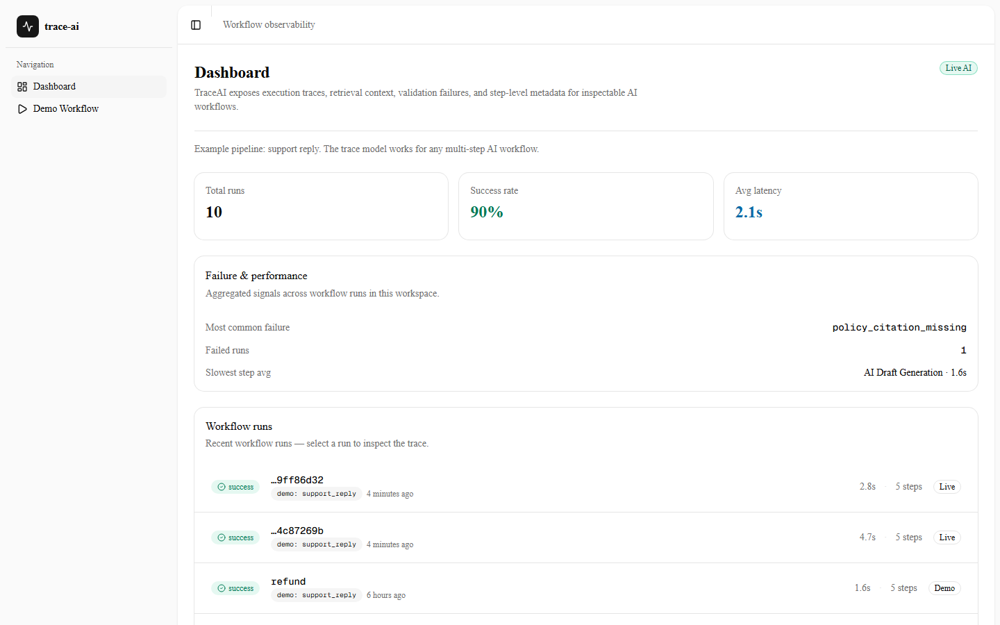
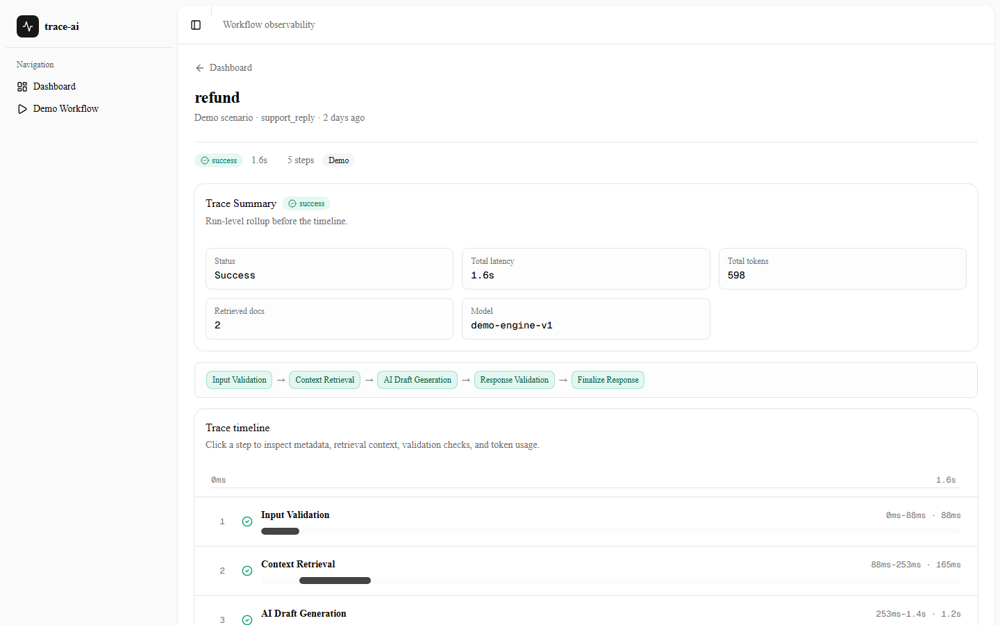
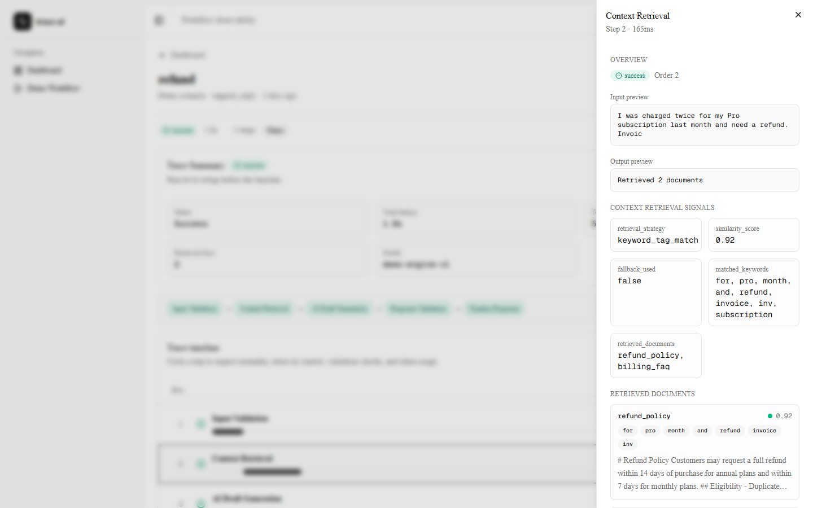

# TraceAI

Most AI applications hide their internal workflow behind a single response.

TraceAI makes AI workflows inspectable by breaking each run into ordered execution steps with status, latency, metadata, input/output previews, retrieved context, and generation details.

**Live demo:** https://trace-ai.osmanyigitsokel.com

**Stack:** Next.js · TypeScript · Neon PostgreSQL · Tailwind · shadcn/ui · Gemini Flash optional

## Preview







## Why this exists

AI applications are rarely a single prompt → response call.

They often include input validation, retrieval, generation, validation, retries, fallback behavior, and metadata handling. Without visibility into those steps, debugging becomes guesswork.

TraceAI explores how AI workflow execution can be represented as an inspectable trace.

## What it shows

- Workflow runs with status, duration, and mode
- Ordered execution steps
- Step-level latency and metadata
- Retrieved policy documents and scores
- AI generation preview and token estimates
- Demo/live mode behavior
- Fallback behavior when live generation fails

## Demo flow

1. Open **Demo Workflow** and pick a preset (e.g. **Refund issue**).
2. Run the pipeline and watch step-by-step progress.
3. Open **View Trace** on the run detail page.
4. Click **Context Retrieval** to see retrieved documents and scores.
5. Click **AI Draft Generation** to see latency, token estimates, and output preview.

## Engineering notes

- The project models AI execution as a workflow trace, not a single black-box API call.
- Progress updates use newline-delimited JSON events for step-level progress (`step_start`, `step_complete`, `run_complete`).
- This is intentionally different from LLM token streaming or full realtime distributed tracing.
- The core scope is workflow visibility, not enterprise monitoring.

For the full distinction, see [docs/architecture.md — Sequential progress vs streaming](docs/architecture.md#sequential-progress-vs-streaming).

## Requirements

- Node.js 20+
- [Neon](https://neon.tech) database (`DATABASE_URL`)
- Optional: `GEMINI_API_KEY` for live AI Draft Generation (see [Demo vs live mode](#demo-vs-live-mode))

## Setup

```bash
npm install
cp .env.example .env   # fill in DATABASE_URL (.env.local also works)
npm run db:setup
npm run dev
```

Open [http://localhost:3000](http://localhost:3000).

## Environment variables

| Variable | Required | Description |
|----------|----------|-------------|
| `DATABASE_URL` | Yes | Neon PostgreSQL connection string |
| `GEMINI_API_KEY` | No | Enables **live** mode for AI Draft Generation |
| `GEMINI_MODEL` | No | Primary model; default `gemini-2.5-flash` |
| `GEMINI_MODEL_FALLBACK` | No | Tried on 503/quota; default `gemini-2.5-flash-lite` |

## Demo vs live mode

- **Demo** (no `GEMINI_API_KEY`): deterministic engine for all steps; AI draft uses a built-in template.
- **Live** (`GEMINI_API_KEY` set): AI Draft Generation calls Gemini Flash; run `mode` is stored as `live`.
- On 503/quota/etc., live mode tries `GEMINI_MODEL_FALLBACK` first, then the demo draft if all models fail.

## Scripts

| Command | Description |
|---------|-------------|
| `npm run dev` | Start development server |
| `npm run build` | Production build |
| `npm run lint` | ESLint |
| `npm run db:migrate` | Apply `db/schema.sql` to Neon |
| `npm run db:seed` | Seed policy docs and sample runs |
| `npm run db:setup` | `db:migrate` + `db:seed` |

## Deploy

Deploy to [Vercel](https://vercel.com) and set `DATABASE_URL` (and optionally `GEMINI_API_KEY`) in project environment variables. Run `npm run lint` and `npm run build` before shipping.

## Out of scope

TraceAI is intentionally not:

- A multi-user SaaS product
- A workflow builder
- A vector search platform
- A full distributed tracing system
- An enterprise cost analytics dashboard

## Project docs

- [Architecture](docs/architecture.md)
- [Status / launch checklist](docs/status.md)
- [Workflow rules](docs/workflow.md)
